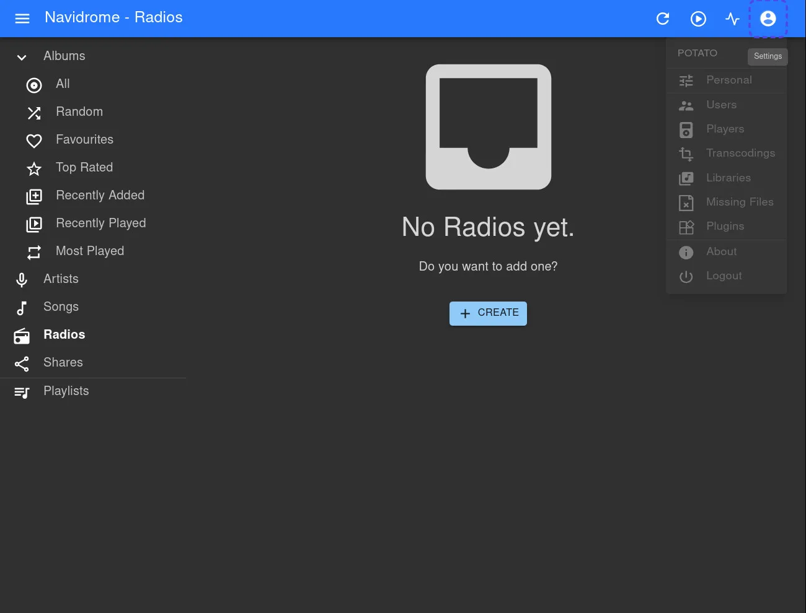
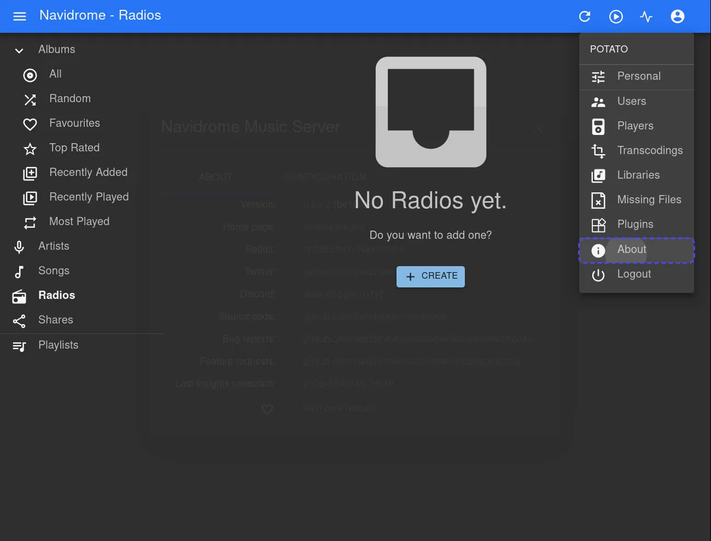
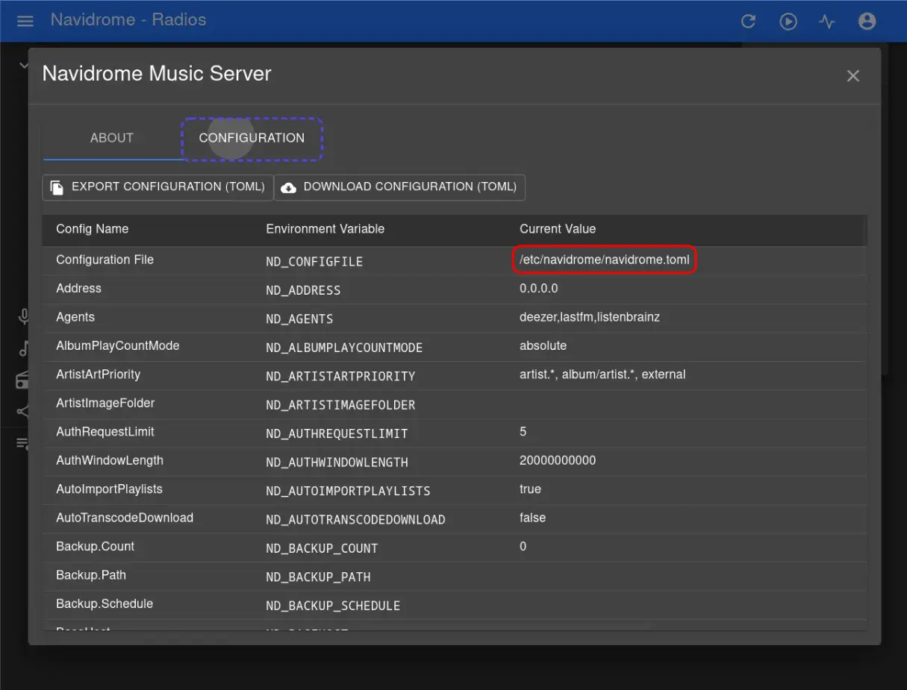

# Navidrome-to-Listenbrainz
A simple CLI tool, made in Python, to help you import your listening history and your favourites (liked tracks) from Navidrome to ListenBrainz.

## Requirements

- Python >= `3.10`

---

## Note

Please note that ListenBrainz *may take some time* to display newly imported data. If the import completed successfully, please be patient and allow anywhere from a few minutes to an hour for the changes to appear in your ListenBrainz profile.

---

## Guide

### 0. Locate your Navidrome database file

Navidrome stores everything in an SQLite database called `navidrome.db`, kept in a folder specified in your Navidrome configuration file (`navidrome.toml`).

If you don't remember where `navidrome.db` is located, you must find your **configuration file**. You can find your **configuration file** in your Navidrome web interface following these steps:

1. Click the **Settings** icon


2. Click **About**


3. And then, finally, Click **Configuration**



The filepath of your **configuration file** (`navidrome.toml`) is shown in the first row under the *'Current Value'* column. Once you have that path, enter the **configuration file** and look for the `DataFolder` variable; that should contain the path of the folder where `navidrome.db` resides. Navigate to that folder and there you should be finally able to find `navidrome.db`.

Please note that `navidrome.db-wal`, `navidrome.db-shm` or any of the sorts are not to be confused with `navidrome.db`, as those are unrelated SQLite's temporary files.


### 1. Copy your Navidrome database here

Now that you've found your `navidrome.db`, copy it inside the `resources` folder located inside this project's folder (If the `resources` folder doesn't exist, create it):

```
Navidrome-to-Listenbrainz/
├── resources/
│   └── navidrome.db    <-- Here
├── utils/
├── main.py
├── config.json
├── requirements.txt
...
```

Or just put it wherever you want and update the path in the `db_path` key from `config.json` to reflect that.


### 2. Get your ListenBrainz token

Go to your [ListenBrainz profile settings](https://listenbrainz.org/profile/) and copy your user token, or keep it for later. The tool requires it in order to function; it is requested upon the execution of the tool.


### 3. Run it

Open a console inside this project's folder and, depending on the setup, run
```bash
python main.py
```
or
```bash
python3 main.py
```

And you should be done! The tool will walk you through the rest interactively and hopefully help you.

However, on the occasion that this outputs any error, ***run the following commands*** on the console open in this project's folder (The commands slightly vary depending on your operating system):

On **Mac/Linux/FreeBSD:**
```bash
python3 -m venv .venv
source .venv/bin/activate
pip install -r requirements.txt
python3 main.py
```

On **Windows:**
```bat
python -m venv .venv
.venv\Scripts\activate
pip install -r requirements.txt
python main.py
```
(Assuming you're using the *Command Prompt (CMD)*; if you are using *PowerShell (PS)*, then you must run `venv\Scripts\Activate.ps1` as opposed to `venv\Scripts\activate`).

If this works, next time you'll want to run the program you'll only need to activate the `venv` again and run `main.py`, as such:

On **Mac/Linux/FreeBSD:**
```bash
source .venv/bin/activate
python3 main.py
```

On **Windows:**

In the *Command Prompt (CMD)*:
```bat
.venv\Scripts\activate
python main.py
```
In *PowerShell (PS)*:
```powershell
.venv\Scripts\Activate.ps1
python main.py
```

If you are still running into issues (Sad :[ ), make sure you have **Python 3.10** or **higher** installed on your system.

---

## Configuration

All settings live in `config.json`:

|Key|Default|Description|
|-----|---------|-------------|
|`db_path`|`resources/navidrome.db`|Path to the Navidrome database file|
|`listenbrainz_submit_url`|*([ListenBrainz API](https://api.listenbrainz.org/1/submit-listens))*|Endpoint to submit listens (scrobbles) to|
|`listenbrainz_feedback_url`|*([ListenBrainz API](https://api.listenbrainz.org/1/feedback/recording-feedback))*|Endpoint to submit feedbacks (favourites) to|
|`listenbrainz_validate_url`|*([ListenBrainz API](https://api.listenbrainz.org/1/validate-token))*|Endpoint to validate a token|
|`max_submit_attempts`|`3`|Maximum number of attempts before aborting a batch or feedback|
|`seconds_before_reattempt`|`2`|How long to wait (in seconds) before retrying to submit a failed batch or feedback|

The path to the **configuration file** can only be changed by directly modifying the default value of the `config_path` parameter in the `load_config` function, located in `main.py`.

---

## Future Updates

### Better handling of legacy listens from *before the Navidrome 0.59.0 update*

As of now, the tool queries the `scrobbles` table, a feature from [Navidrome 0.59.0](https://github.com/navidrome/navidrome/releases/tag/v0.59.0) and [newer versions](https://www.navidrome.org/docs/usage/features/scrobbling/). Older Navidrome versions relied, essentially, on `play_count` and `last_played` only, in this regard. This means that people with older versions of Navidrome, or even those on newer versions but with a library containing listens from before the update, lose the play count for individual songs if higher than one.

Since the tool already has the capability to randomise dates, this could be leveraged for that purpose. Ergo, when no `submission_time` is found, it will, first, attempt to fall back to `play_count` and `last_played` for that specific listen and, if these fields exist and are valid, it will submit one instance of said track with the timestamp set to `last_played`; then add the remaining plays to the list of listens to randomise dates for, which is, in fact, already an existing feature. For listens that also lack these fields, the behaviour will remain the exact same as before the update of this tool.

---

### Automatic Scheduler for Navidrome-to-ListenBrainz *Feedback (Favourites) Sync*

At the time of writing this, Navidrome does not directly support sending feedback to ListenBrainz *(Which, in Navidrome terms, are favourites)*. The only way, at the moment, to update likes to ListenBrainz from Navidrome is to either manually run a script, or set up a proper scheduler app. The latter is a pretty good idea, but setting one up may not be appealing to everyone. Therefore, to provide a simpler alternative, a simple and lightweight script, using the existing functions, will act as a basic Python scheduler for this exact purpose. Keep in mind that the script will still need to be started again if the machine shuts down. Because of this, a guide will also be provided on how to have it automatically run after startup. If the machine was shut down while an execution was due to occur, the scheduler will run the tool immediately after boot, provided that the configured settings allow for it.

---

### ListenBrainz to Navidrome (Listens/Scrobbles and Feedback/Favourites)

Pretty self-explanatory. To evaluate at a later date (Would be pretty cool, to be honest!).

---
